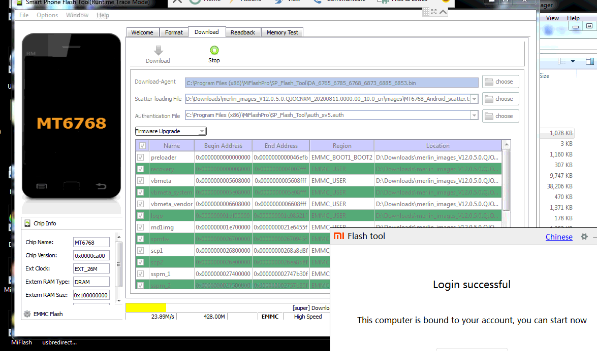

# Fix Bricked Redmi Note 9

## A Step-by-Step Guide to Restoring a Completely Bricked Redmi Note 9

Hi, In this guide, I will teach you how to fix a hard-bricked Redmi Note 9 (merlin) and bring it back to its original state. A hard-bricked Redmi Note 9 is characterized by being stuck in an infinite boot loop, showing only the Redmi logo. You might be unable to access recovery with power+vol down, enter fastboot, or even connect it to a computer. If this is your situation, don't worry – you can solve it without the need for professional service.

**Important Note:** Following this guide will result in the erasure of all data on your phone, including any custom Recovery or ROM. The bootloader will also be locked again. Keep in mind that you're at a point where your device is either a useless brick or a working phone – the choice is yours.

This guide has been tested by me and proven to work, as long as you follow the steps carefully and don't skip anything. (I completed these steps on Windows 10.)

### Prerequisites

Before you begin, make sure you have the following:

- Python installed (version 3.9.7 or the latest version)
- Official Xiaomi fastboot image for Redmi Note 9
- The provided zip file containing MTK Drivers, SP Flash Tool, and additional scripts
- USB cable
- Windows 10 (this guide assumes Windows operating system)

### Step 1: Prepare the Required Files

1. Download Python from the official website and install it. During installation, select the "Add Python to PATH" option. To verify the installation, open Command Prompt and type `python` or `py`. You should see the Python version.
2. Download the official Xiaomi fastboot image for Redmi Note 9 from this [website](https://xiaomifirmwareupdater.com/archive/miui/merlin/). Choose your version (e.g., "merlin_images....tgz") and download the "Full ROM" file.
##NOTE: Don't download the zip. Download the tgz file
3. Download the zip file containing MTK Drivers, SP Flash Tool, and additional scripts from the provided [Google Drive link](https://drive.google.com/file/d/1aSQ58gKY93bpcclFCxndSpKeE3pnE3qm/view?usp=sharing).

### Step 2: Battery Drain

Allow the phone's battery to completely drain to ensure the boot looping ends. This step helps prevent errors during the restoration process.

### Step 3: Install MTK Drivers

1. Extract the downloaded zip file containing MTK Drivers.
2. Navigate to the "MTK Driver" folder and run "MTK_Driver_Auto_Installer_SP_Drivers_20160804.exe" to install the MTK Driver.
3. Reboot your computer after the driver installation.

### Step 4: Install USB Drivers and Libraries

1. Extract the downloaded zip file and locate the "libusb" folder.
2. Run "libusb-win32-devel-filter-1.2.6.0.exe" and follow the installation prompts.
3. When prompted, launch the "Filter Installer Wizard." Select "Install a device filter" and choose your connected USB devices, including your Redmi Note 9.

### Step 5: Bypass Mi Authentication

1. Navigate to the "bypass" folder from the extracted zip file.
2. Run "1ST RUN THIS.bat" and wait for the "waiting for device" message.
3. While holding the volume up button, connect your phone to the computer. Release the button when the device is recognized.
4. If you encounter a "RuntimeError" with "unexpected output," close the script, disconnect your phone, and try "2ND RUN THIS.bat."
5. Run "2ND RUN THIS.bat" and follow the same procedure as above.

### Step 6: Flashing Process

1. Navigate to the "SP Flash Tool" folder from the extracted zip file and run "flash_tool.exe."
2. Click "Download-Agent" and select "DA_6765_6785_6768_6873_6885_6853.bin" from the SP flash tool folder.
3. Click "Authentication File" and choose "auth_sv5.auth" from the same folder.
4. Click "Scatter-loading File," navigate to the fastboot image extraction folder, enter the "images" folder, and select "MT6768_Android_scatter.txt."
5. Change the "Download Only" option to "Firmware Upgrade" in the drop-down box below "Authentication File."
6. Go to "Options" -> "Option..." and under the "Connection" tab, check "UART" and set the Baud rate to 921600. Set the COM port to "COM3."
7. Close the options window.

### Step 7: Flashing the Firmware

1. Click the green arrow "Download" button in SP Flash Tool.
2. Allow the flashing process to complete without interruption. Do not touch any buttons during this time.
3. If you encounter "Error: STATUS_STOR_LIFE_EXHAUST," uncheck "Storage life cycle check" in "Options" -> "General."
4. When the flashing is successful, a pop-up window with a green background and checkmark will appear. Close it and exit SP Flash Tool.

### Step 8: Device Boot-up

1. Disconnect your device from the computer and press the power button to start your phone.
2. Connect your phone to a charger or computer to ensure it doesn't run out of charge.
3. Your phone should boot normally, displaying the MIUI logo. The initial boot may take a few minutes.
4. Follow the setup prompts on the screen.

Congratulations! You have successfully restored a hard-bricked Redmi Note 9 back to life. Your device should now be functioning as expected.

---

**Note**: This guide is based on information available as of September 2021. Please verify any updates or changes in tools and procedures if you are attempting this guide after that date.
